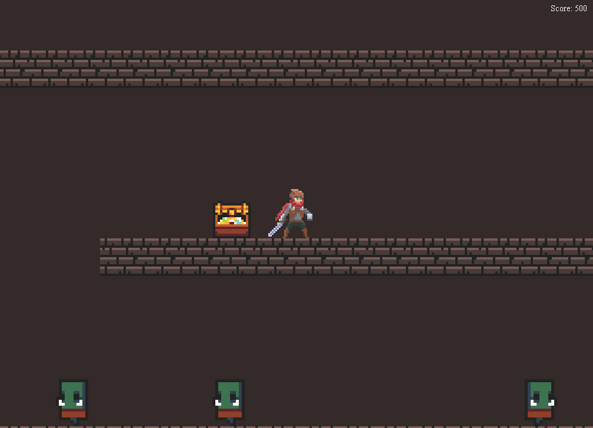

# Game2D Dungeon

## Introduction
This game is a university assignment project. It is written in Java, based on a modified version of the game2D engine. The main goal of this project was to practice common game theory problems and come up with practical solutions. I took the opportunity to simultaneously practice Java 8 streams, which you could find overused in the source code of this project.

## Screenshot


## Assets used
- https://rvros.itch.io/animated-pixel-hero
- https://0x72.itch.io/dungeontileset-ii
- https://0x72.itch.io/16x16-dungeon-tileset

## Download
Check out the releases page

## Controls
- <kbd>W A S D</kbd> or <kbd>↑ ← ↓ →</kbd> - move around
- <kbd>Space</kbd> - attack
- <kbd>Esc</kbd> - quit game
- <kbd>F</kbd> - show/hide collision boxes
- <kbd> Left Mouse Button</kbd> - kill enemies and open treasures (cheat)

## Objects
| Object    | Type         | Property     | Description    |
| -------- | ------------ | ------------ | -------------- |
| Treasure | trigger      | non-passable | hit to open    |
| Cube     | non-blocking | pushable     | push it around |

---

## Compiling
You can simply run the provided gradle wrapper with the build command:
```bash
./gradlew build
```
The resulting executable `JAR` will be located under: `build/libs/game2d-dungeon-SNAPSHOT.jar`

## Engine changes
A couple of changes were required to the game2D engine, mostly in order to avoid overly hacky workarounds.

### TileMap
- All resources are now embedded and loaded from the `JAR`
- Support for displaying tile collision boxes
- Support for scaling tiles by a factor

### Sprite
- Support for flipping sprites horizontally

### Sound
- Massive performance improvements by keeping the `Clip` loaded in memory. This prevents an issue with the old implementation which randomly delays and cancels sound playback.
- Support for filter streams

### GameCore
- Implements `MouseListener`
- Exit `JFrame` on window close

## Game breakdown
Below are the main processes I went through to create this game. They include an introduction to the game engine and explanations of the most important game theory concepts.

### game2D
The game engine follows a traditional approach of separating `Tiles` and `Sprites`. `Tiles` are defined in a text-based map file, and they do not support animation. `Sprites`, on the other hand, are loaded programmatically, and take a single animated tile set. Unfortunately, they cannot be embedded in the map file, which causes some segregation.

### Preparing assets
After finding some assets online, I imported them to [Tiled Map Editor](https://www.mapeditor.org/) for closer inspection. When I chose what I wanted to use for my game, I used [imagemagick](https://imagemagick.org/index.php) to split the tile sets to individual images:
```bash
convert -crop 16x16 +repage tileset.png %d.png
```
From there, I used [this Python script](merge.py) to merge any individual animation tiles into animation sets supported by the game engine.

### Following camera
The following camera was easy to achieve, simply by offsetting everything that is rendered based on the player's absolute position. Customizable bounding was added to the camera as well, so the camera cannot look beyond the left and right borders of the map.

### GameObject
Based on Unity's `GameObject` pattern, this game implements an abstract, feature-rich object that can be used to quickly spawn and bring to life various entities. All non-static entities such as the `Player` and `NPC`s inherit from this object. 

### Collision detection
#### Defining boundaries
All `GameObjects` have at least one `AnimationState`, such as standing, walking, attacking. Since all animations for an entity have to fit in the same tile, one large animation is enough to stretch the tile for all the others. Consider the screenshots below:

<table>
    <td width="50%"></td>
    <td width="50%"></td>
</table>

As we can see, the attack animation on the right is many times wider than the standing animation on the left. Yet, the tile rectangle (blue) stays the same. If we were to implement a naive bounding box that covers the whole tile, this blue rectangle is what we would get. Needless to say, that would result in very confusing and unrealistic physics.

To solve this problem, we can  opt for customized bounding boxes for each animation. This way, we have individual control over each `AnimationState`. In the screenshot above, these collision boxes are the red rectangles.

I used [Tiled Map Editor](https://www.mapeditor.org/) to easily define the collision boxes, and then transferred them over to my game by looking at Tiled's project file, which is an easily readable XML.

#### Finding collision
Now that we have accurate boundaries, we need a way to find all `Tiles` and `GameObjects` that are colliding with a given `GameObject`. One could loop through every possible combination of objects, but that would burn the CPU instantly. To avoid that, I used the following logic:
##### Finding `Tiles`
- Find all `Tiles` that the `GameObject` tile rectangle (blue) covers
- From them, filter the colliding `Tiles`
- From them, filter the colliding bounding boxes (red)
##### Finding `GameObjects`
- I created `GameObjectMap` - a two-way map between `GameObjects` and the `Tile` coordinates they cover. It is always up-to-date and allows instant lookups.
- Find all `Tiles` that the `GameObject` tile rectangle (blue) covers
- Through the `GameObjectMap`, retrieve all `GameObjects` that cover those `Tiles`
- Filter out pairs of colliding bounding boxes (red)

#### Resolving collision
Now that we have the collision coordinates, it is time to resolve them. At first you could be tempted to say that, since each colliding `Tile` is static, you could simply push back your `Player` so that he no longer overlaps. What you will find is that this works very well for a single collision at a time, but with more than one (e.g, a corner) your `Player` will clip right through the walls. This is because some `Tiles` will find it closer to push the `Player` towards other `Tiles`, and the result is chaos.

After a lot of trial and error, I devised the following stable approach:
- For each collision, get the _smallest_ collision rebound direction and save it in a vector. You will end up with a list like this: `Point(10, 0)`, `Point(0, -3)`, ...
- Add all the vectors together so that you get the _biggest_ collision rebound
- Apply the above rebound to the `Player`
- Repeat this process until no more collision is detected

## Further improvements
A lot of improvements can be made to this game, given the current status is just a prototype. Nevertheless, some major notes include:

### Quality
- More realistic gravity
  - The current gravity implementation follows simple linear `Velocity`, and it is not very intuitive. More realistic gravity could be applied.
- Code clean-up
  - Although best effort was made to keep the code lean and mean, it could take a big refactor.
- Better event system
  - At present, the event system to update and coordinate `GameObjects` is very primitive, and will likely require change for more advanced interactions.
- Behavior trees
  - Behavior trees can be used to express all possible states of the entities, avoiding the hard-to-maintain and bug-prone spaghetti of conditional statements that is the `Player`'s event handling right now.

### Gameplay
- More levels
  - Should be achievable without touching the source code, just by modifying the map files, although the possibilities would be limited 
- More entities (tiles, enemies, usables such as weapons)
- Menu
- Local multi-player
